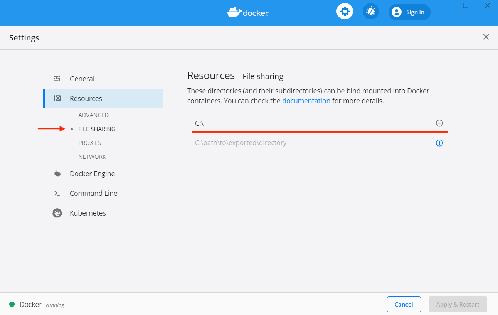

# Beamr Args Converter for Hybrik Jobs

## Simplest usage, use Dockerhub image
### Mac:
1) Install [Docker client](https://www.docker.com/products/docker-desktop)
2) pull the dockerhub image: `docker pull hybriksupport/beamr_args`
3) navigate in a terminal to the directory with your config file and job json
4) run
  ```
  docker run -v "`pwd`":"`pwd`" -w "`pwd`" hybriksupport/beamr_args -c 422UF20.cfg beamr_job.json
  ```

### Windows:
1) Install [Docker client](https://www.docker.com/products/docker-desktop)
2) Open Docker settings, then under `Resources > File Sharing` click the `+` button to add your `C:\` drive
   
3) navigate in Windows Powershell x86 to the directory with your config file and job json
4) run
  ```
  docker run -v ${PWD}:/beamr_args hybriksupport/beamr_args -c 422UF20.cfg beamr_job.json
  ```

## Run Locally (build and run)
## Requirements (either):
* Local install (harder):
  * Python 3.6+
  * [jsonpath-rw](https://github.com/kennknowles/python-jsonpath-rw) (from git source, not a package manager)
  * [jsonpath-rw-ext](https://pypi.org/project/jsonpath-rw-ext/) (from pip, 1.4.0+)
  * cloned this repository
  * access to a command line

## Installation
* Clone this repository from github (navigate your terminal to a save location)
  * `git clone git@github.com:dolby-hybrik-support/beamr_args.git`

## Run Locally
* `python beamr_args.py -c 422UF20.cfg beamr_job.json`

### Full Usage
```
usage: beamr_args.py [-h] -c CONFIG [--verbose] job

Convert a beamr .cfg file into a Hybrik Job

positional arguments:
  job                   input job file

optional arguments:
  -h, --help            show this help message and exit
  -c CONFIG, --config CONFIG
                        beamr.cfg file)
  --verbose             Verbose output
```
